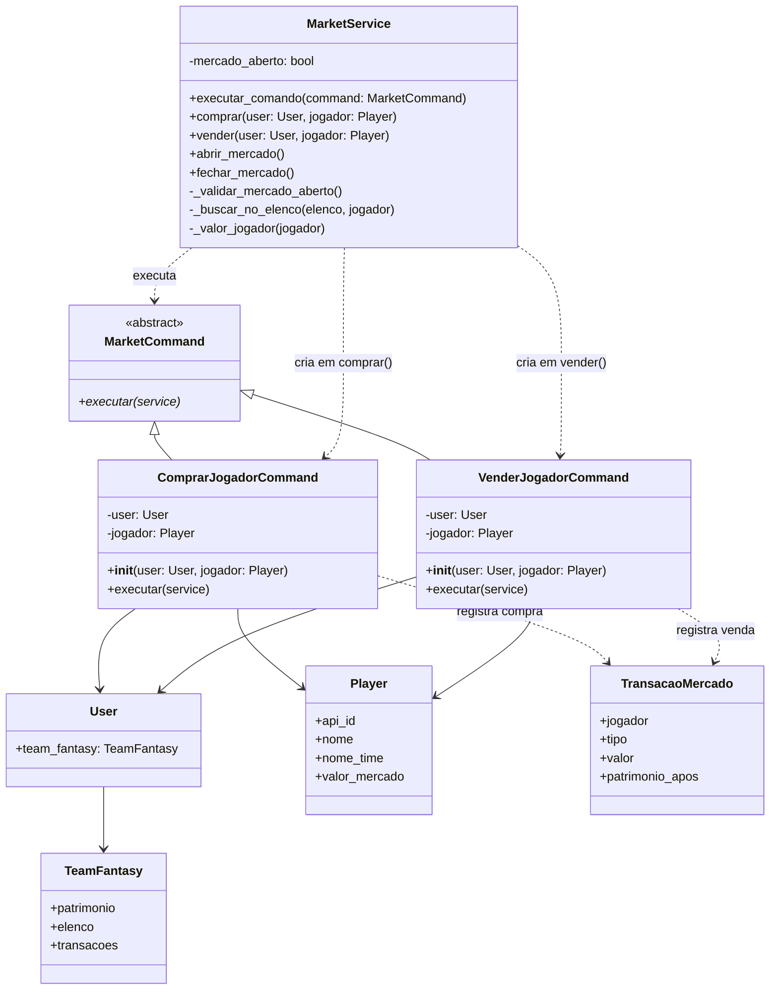
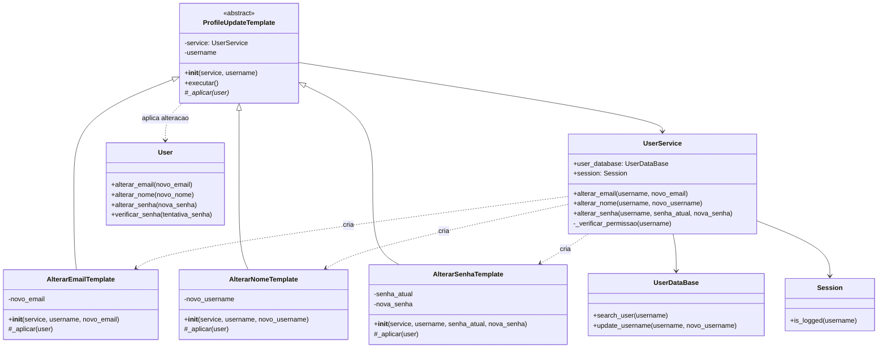
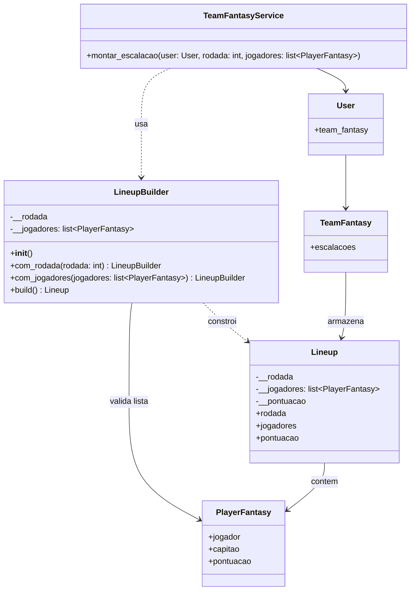

# Padroes de Projeto - Diagramas de Classes

Este documento apresenta apenas os diagramas de classes dos padroes de projeto implementados no projeto. Os diagramas focam nas classes que participam de cada padrao, sem representar todo o modelo de dominio do SofaFut.

## 1. Command - UC08 Negociar Atletas

**Objetivo:** encapsular as operacoes de compra e venda de atletas como comandos executaveis pelo `MarketService`.

**Participantes do padrao:**

- `MarketCommand`: interface abstrata do comando.
- `ComprarJogadorCommand`: comando concreto para compra de jogador.
- `VenderJogadorCommand`: comando concreto para venda de jogador.
- `MarketService`: invoker que valida o mercado e executa o comando.
- `User` e `Player`: dados usados pelos comandos.
- `TeamFantasy` e `TransacaoMercado`: objetos de dominio alterados pelos comandos.

## 2. Template Method - UC13 Gerenciar Perfil

**Objetivo:** reutilizar o fluxo comum de alteracao de perfil, deixando cada alteracao concreta implementar apenas o passo especifico.

**Participantes do padrao:**

- `ProfileUpdateTemplate`: classe abstrata que define o algoritmo fixo em `executar()`.
- `AlterarEmailTemplate`: implementa a alteracao de email.
- `AlterarNomeTemplate`: implementa a alteracao de username.
- `AlterarSenhaTemplate`: implementa a alteracao de senha.
- `UserService`: contexto usado pelos templates e fachada chamada pelos controllers.
- `UserDataBase`, `Session` e `User`: dependencias usadas no fluxo comum.

## 3. Builder - Montagem de Escalacao

**Objetivo:** construir uma `Lineup` de forma controlada, validando quantidade de jogadores e capitao antes de criar o objeto final.

**Participantes do padrao:**

- `LineupBuilder`: builder responsavel por configurar rodada e jogadores antes do `build()`.
- `TeamFantasyService`: cliente que usa o builder para montar a escalacao.
- `Lineup`: produto criado pelo builder.
- `PlayerFantasy`: item usado na composicao da escalacao.

