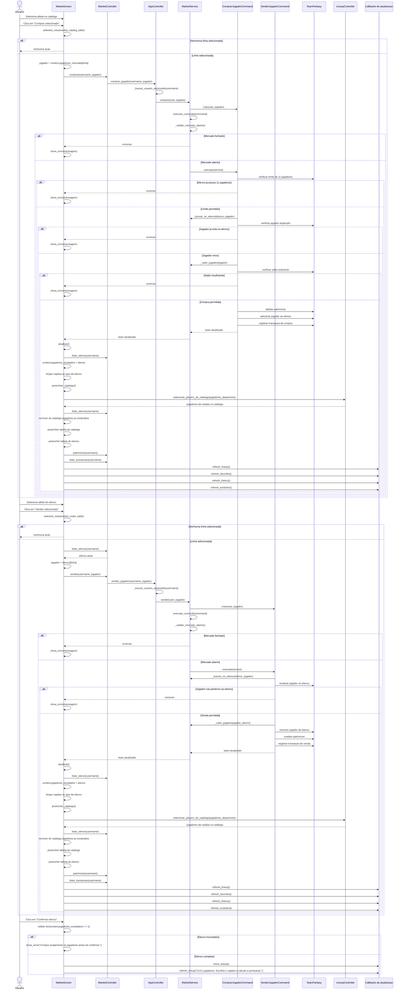

# UC08 - Diagrama de Sequencia: Negociar Atletas

```mermaid
sequenceDiagram
    actor Usuario
    participant Tela as MarketScreen
    participant MarketCtrl as MarketController
    participant AppCtrl as AppController
    participant MarketSvc as MarketService
    participant BuyCmd as ComprarJogadorCommand
    participant SellCmd as VenderJogadorCommand
    participant Team as TeamFantasy
    participant LineupCtrl as LineupController
    participant Refresh as Callbacks de atualizacao

    Usuario->>Tela: Seleciona atleta no catalogo
    Usuario->>Tela: Clica em "Comprar selecionado"
    Tela->>Tela: selected_rows(market_catalog_table)

    alt Nenhuma linha selecionada
        Tela-->>Usuario: nenhuma acao
    else Linha selecionada
        Tela->>Tela: jogador = context.jogadores_mercado[linha]
        Tela->>MarketCtrl: comprar(username, jogador)
        MarketCtrl->>AppCtrl: comprar_jogador(username, jogador)
        AppCtrl->>AppCtrl: _buscar_usuario_autorizado(username)
        AppCtrl->>MarketSvc: comprar(user, jogador)
        MarketSvc->>BuyCmd: criar(user, jogador)
        MarketSvc->>MarketSvc: executar_comando(command)
        MarketSvc->>MarketSvc: _validar_mercado_aberto()

        alt Mercado fechado
            MarketSvc-->>Tela: excecao
            Tela->>Tela: show_error(mensagem)
        else Mercado aberto
            MarketSvc->>BuyCmd: executar(service)
            BuyCmd->>Team: verificar limite de 11 jogadores

            alt Elenco ja possui 11 jogadores
                BuyCmd-->>Tela: excecao
                Tela->>Tela: show_error(mensagem)
            else Limite permitido
                BuyCmd->>MarketSvc: _buscar_no_elenco(elenco, jogador)
                BuyCmd->>Team: verificar jogador duplicado

                alt Jogador ja esta no elenco
                    BuyCmd-->>Tela: excecao
                    Tela->>Tela: show_error(mensagem)
                else Jogador novo
                    BuyCmd->>MarketSvc: _valor_jogador(jogador)
                    BuyCmd->>Team: verificar saldo suficiente

                    alt Saldo insuficiente
                        BuyCmd-->>Tela: excecao
                        Tela->>Tela: show_error(mensagem)
                    else Compra permitida
                        BuyCmd->>Team: debitar patrimonio
                        BuyCmd->>Team: adicionar jogador ao elenco
                        BuyCmd->>Team: registrar transacao de compra
                        BuyCmd-->>MarketSvc: team atualizado
                        MarketSvc-->>Tela: team atualizado
                        Tela->>Tela: atualizar()
                        Tela->>MarketCtrl: listar_elenco(username)
                        Tela->>Tela: context.jogadores_escalados = elenco
                        Tela->>Tela: limpar capitao se saiu do elenco
                        Tela->>Tela: preencher_catalogo()
                        Tela->>LineupCtrl: selecionar_players_do_catalogo(jogadores_disponiveis)
                        LineupCtrl-->>Tela: jogadores da rodada no catalogo
                        Tela->>MarketCtrl: listar_elenco(username)
                        Tela->>Tela: remover do catalogo jogadores ja comprados
                        Tela->>Tela: preencher tabela de catalogo
                        Tela->>Tela: preencher tabela do elenco
                        Tela->>MarketCtrl: patrimonio(username)
                        Tela->>MarketCtrl: listar_transacoes(username)
                        Tela->>Refresh: refresh_lineup()
                        Tela->>Refresh: refresh_favorites()
                        Tela->>Refresh: refresh_history()
                        Tela->>Refresh: refresh_evolution()
                    end
                end
            end
        end
    end

    Usuario->>Tela: Seleciona atleta do elenco
    Usuario->>Tela: Clica em "Vender selecionado"
    Tela->>Tela: selected_rows(market_roster_table)

    alt Nenhuma linha selecionada
        Tela-->>Usuario: nenhuma acao
    else Linha selecionada
        Tela->>MarketCtrl: listar_elenco(username)
        MarketCtrl-->>Tela: elenco atual
        Tela->>Tela: jogador = elenco[linha]
        Tela->>MarketCtrl: vender(username, jogador)
        MarketCtrl->>AppCtrl: vender_jogador(username, jogador)
        AppCtrl->>AppCtrl: _buscar_usuario_autorizado(username)
        AppCtrl->>MarketSvc: vender(user, jogador)
        MarketSvc->>SellCmd: criar(user, jogador)
        MarketSvc->>MarketSvc: executar_comando(command)
        MarketSvc->>MarketSvc: _validar_mercado_aberto()

        alt Mercado fechado
            MarketSvc-->>Tela: excecao
            Tela->>Tela: show_error(mensagem)
        else Mercado aberto
            MarketSvc->>SellCmd: executar(service)
            SellCmd->>MarketSvc: _buscar_no_elenco(elenco, jogador)
            SellCmd->>Team: localizar jogador no elenco

            alt Jogador nao pertence ao elenco
                SellCmd-->>Tela: excecao
                Tela->>Tela: show_error(mensagem)
            else Venda permitida
                SellCmd->>MarketSvc: _valor_jogador(jogador_elenco)
                SellCmd->>Team: remover jogador do elenco
                SellCmd->>Team: creditar patrimonio
                SellCmd->>Team: registrar transacao de venda
                SellCmd-->>MarketSvc: team atualizado
                MarketSvc-->>Tela: team atualizado
                Tela->>Tela: atualizar()
                Tela->>MarketCtrl: listar_elenco(username)
                Tela->>Tela: context.jogadores_escalados = elenco
                Tela->>Tela: limpar capitao se saiu do elenco
                Tela->>Tela: preencher_catalogo()
                Tela->>LineupCtrl: selecionar_players_do_catalogo(jogadores_disponiveis)
                LineupCtrl-->>Tela: jogadores da rodada no catalogo
                Tela->>MarketCtrl: listar_elenco(username)
                Tela->>Tela: remover do catalogo jogadores ja comprados
                Tela->>Tela: preencher tabela de catalogo
                Tela->>Tela: preencher tabela do elenco
                Tela->>MarketCtrl: patrimonio(username)
                Tela->>MarketCtrl: listar_transacoes(username)
                Tela->>Refresh: refresh_lineup()
                Tela->>Refresh: refresh_favorites()
                Tela->>Refresh: refresh_history()
                Tela->>Refresh: refresh_evolution()
            end
        end
    end

    Usuario->>Tela: Clica em "Confirmar elenco"
    Tela->>Tela: validar len(context.jogadores_escalados) == 11

    alt Elenco incompleto
        Tela->>Tela: show_error("Compre exatamente 11 jogadores antes de confirmar.")
    else Elenco completo
        Tela->>Refresh: show_lineup()
        Tela->>Refresh: refresh_lineup("11/11 jogadores. Escolha o capitao e calcule a pontuacao.")
    end
```
