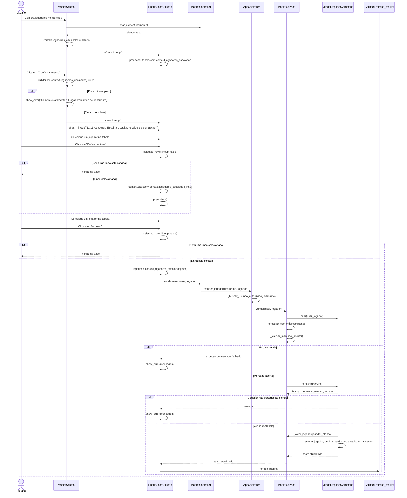
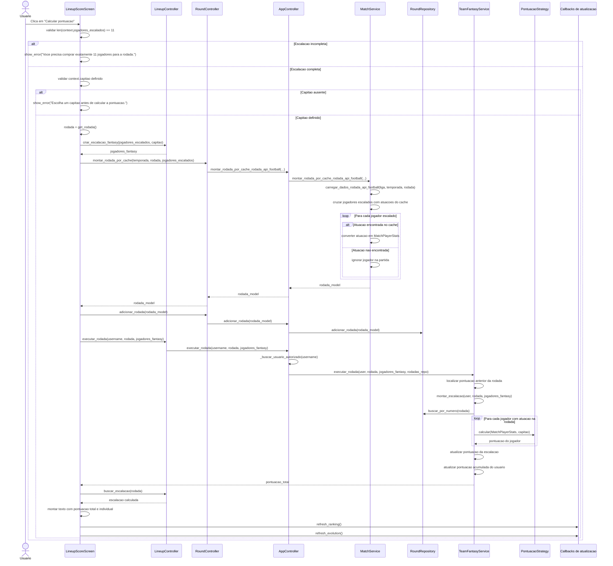

# UC09 e UC10 - Diagramas de Sequencia

## UC09 - Escalar time

```mermaid
sequenceDiagram
    actor Usuario
    participant Mercado as MarketScreen
    participant Tela as LineupScoreScreen
    participant Market as MarketController
    participant App as AppController
    participant MarketSvc as MarketService
    participant SellCmd as VenderJogadorCommand
    participant Refresh as Callback refresh_market

    Usuario->>Mercado: Compra jogadores no mercado
    Mercado->>Market: listar_elenco(username)
    Market-->>Mercado: elenco atual
    Mercado->>Mercado: context.jogadores_escalados = elenco
    Mercado->>Tela: refresh_lineup()
    Tela->>Tela: preencher tabela com context.jogadores_escalados

    Usuario->>Mercado: Clica em "Confirmar elenco"
    Mercado->>Mercado: validar len(context.jogadores_escalados) == 11

    alt Elenco incompleto
        Mercado->>Mercado: show_error("Compre exatamente 11 jogadores antes de confirmar.")
    else Elenco completo
        Mercado->>Tela: show_lineup()
        Mercado->>Tela: refresh_lineup("11/11 jogadores. Escolha o capitao e calcule a pontuacao.")
    end

    Usuario->>Tela: Seleciona um jogador na tabela
    Usuario->>Tela: Clica em "Definir capitao"
    Tela->>Tela: selected_rows(lineup_table)

    alt Nenhuma linha selecionada
        Tela-->>Usuario: nenhuma acao
    else Linha selecionada
        Tela->>Tela: context.capitao = context.jogadores_escalados[linha]
        Tela->>Tela: preencher()
    end

    Usuario->>Tela: Seleciona um jogador na tabela
    Usuario->>Tela: Clica em "Remover"
    Tela->>Tela: selected_rows(lineup_table)

    alt Nenhuma linha selecionada
        Tela-->>Usuario: nenhuma acao
    else Linha selecionada
        Tela->>Tela: jogador = context.jogadores_escalados[linha]
        Tela->>Market: vender(username, jogador)
        Market->>App: vender_jogador(username, jogador)
        App->>App: _buscar_usuario_autorizado(username)
        App->>MarketSvc: vender(user, jogador)
        MarketSvc->>SellCmd: criar(user, jogador)
        MarketSvc->>MarketSvc: executar_comando(command)
        MarketSvc->>MarketSvc: _validar_mercado_aberto()

        alt Erro na venda
            MarketSvc-->>Tela: excecao de mercado fechado
            Tela->>Tela: show_error(mensagem)
        else Mercado aberto
            MarketSvc->>SellCmd: executar(service)
            SellCmd->>MarketSvc: _buscar_no_elenco(elenco, jogador)

            alt Jogador nao pertence ao elenco
                SellCmd-->>Tela: excecao
                Tela->>Tela: show_error(mensagem)
            else Venda realizada
                SellCmd->>MarketSvc: _valor_jogador(jogador_elenco)
                SellCmd->>SellCmd: remover jogador, creditar patrimonio e registrar transacao
                SellCmd-->>MarketSvc: team atualizado
                MarketSvc-->>Tela: team atualizado
                Tela->>Refresh: refresh_market()
            end
        end
    end
```

## UC10 - Calcular pontuacao

```mermaid
sequenceDiagram
    actor Usuario
    participant Tela as LineupScoreScreen
    participant Lineup as LineupController
    participant Round as RoundController
    participant App as AppController
    participant MatchSvc as MatchService
    participant RoundRepo as RoundRepository
    participant Team as TeamFantasyService
    participant Strategy as PontuacaoStrategy
    participant Refresh as Callbacks de atualizacao

    Usuario->>Tela: Clica em "Calcular pontuacao"
    Tela->>Tela: validar len(context.jogadores_escalados) == 11

    alt Escalacao incompleta
        Tela->>Tela: show_error("Voce precisa comprar exatamente 11 jogadores para a rodada.")
    else Escalacao completa
        Tela->>Tela: validar context.capitao definido

        alt Capitao ausente
            Tela->>Tela: show_error("Escolha um capitao antes de calcular a pontuacao.")
        else Capitao definido
            Tela->>Tela: rodada = get_rodada()
            Tela->>Lineup: criar_escalacao_fantasy(jogadores_escalados, capitao)
            Lineup-->>Tela: jogadores_fantasy
            Tela->>Round: montar_rodada_por_cache(temporada, rodada, jogadores_escalados)
            Round->>App: montar_rodada_por_cache_rodada_api_football(...)
            App->>MatchSvc: montar_rodada_por_cache_rodada_api_football(...)
            MatchSvc->>MatchSvc: carregar_dados_rodada_api_football(liga, temporada, rodada)
            MatchSvc->>MatchSvc: cruzar jogadores escalados com atuacoes do cache

            loop Para cada jogador escalado
                alt Atuacao encontrada no cache
                    MatchSvc->>MatchSvc: converter atuacao em MatchPlayerStats
                else Atuacao nao encontrada
                    MatchSvc->>MatchSvc: ignorar jogador na partida
                end
            end

            MatchSvc-->>App: rodada_model
            App-->>Round: rodada_model
            Round-->>Tela: rodada_model
            Tela->>Round: adicionar_rodada(rodada_model)
            Round->>App: adicionar_rodada(rodada_model)
            App->>RoundRepo: adicionar_rodada(rodada_model)
            Tela->>Lineup: executar_rodada(username, rodada, jogadores_fantasy)
            Lineup->>App: executar_rodada(username, rodada, jogadores_fantasy)
            App->>App: _buscar_usuario_autorizado(username)
            App->>Team: executar_rodada(user, rodada, jogadores_fantasy, rodadas_repo)
            Team->>Team: localizar pontuacao anterior da rodada
            Team->>Team: montar_escalacao(user, rodada, jogadores_fantasy)
            Team->>RoundRepo: buscar_por_numero(rodada)

            loop Para cada jogador com atuacao na rodada
                Team->>Strategy: calcular(MatchPlayerStats, capitao)
                Strategy-->>Team: pontuacao do jogador
            end

            Team->>Team: atualizar pontuacao da escalacao
            Team->>Team: atualizar pontuacao acumulada do usuario
            Team-->>Tela: pontuacao_total
            Tela->>Lineup: buscar_escalacao(rodada)
            Lineup-->>Tela: escalacao calculada
            Tela->>Tela: montar texto com pontuacao total e individual
            Tela->>Refresh: refresh_ranking()
            Tela->>Refresh: refresh_evolution()
        end
    end
```
